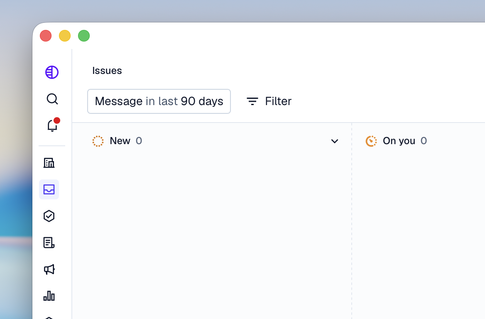

# Build Pylon App (macOS)

One-shot installer and builder for a [Pake](https://github.com/tw93/Pake)-based macOS app that wraps [Pylon](https://app.usepylon.com).



## Quick start (one-liner)

From **Terminal** on macOS, run:

```bash
curl -fsSL https://raw.githubusercontent.com/Ogglord/BuildPylonAppMacOs/main/build.sh | bash
```

### What this does
 **download the script and run it with bash.**


## What the script does

1. Checks you’re on macOS.
2. Installs [Homebrew](https://brew.sh) if missing.
3. Installs Git and Node.js (LTS) via Homebrew.
4. Installs [Pake](https://github.com/tw93/Pake) (pake-cli) globally.
5. Uses the Pylon app icon: it’s in the repo (`PylonIcon.icns`) and is **downloaded automatically** when you run the one-liner. If the download fails, you can choose a custom icon path or continue without one.
6. Prompts for output directory (default: Desktop).
7. Builds the Pylon app with Pake and places the `.app` in your chosen folder.

If macOS blocks the app (Gatekeeper), right-click the app → **Open** once.

### Security note

Piping from the internet into `bash` runs whatever that URL serves. Only use this one-liner if you trust the source (this repo). To inspect first, download without running:

```bash
curl -fsSL https://raw.githubusercontent.com/Ogglord/BuildPylonAppMacOs/main/build.sh -o build.sh
cat build.sh   # review, then:
bash build.sh
```
